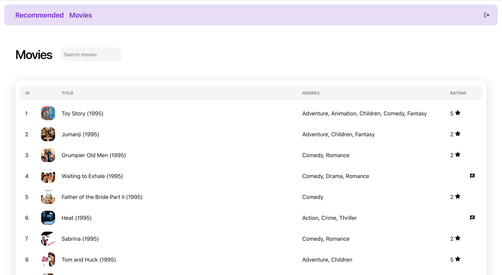

# Movies2watch

A simple movie recommendation system.

Data is downloaded from [the-movies-dataset](https://www.kaggle.com/datasets/rounakbanik/the-movies-dataset) dataset on Kaggle.

## Setup

### 1. Install dependencies

You need to have Docker and docker-compose installed on your system.

### 2. Run the app

This command will build and start the entire application (frontend, backend, database).

After the application starts, you will need to wait for a bit until the initialisation procedure (database seeding) finishes.

```shell
docker-compose up
```

### 3. Open in browser

Open http://localhost:3000 to view the app.

## Overview

This app allows users to discover new movies of interests.

### Movies

App allows you to search through all the movies in the database. You can also rate any movie that you already viewed on a scale 1-5.



### Recommendations

After user rated 10 or more movies, he/she will be included in the recommendation model.

When recommendation predictions are available, users can view them under "Recommended" tab. The predicted ratings are shown in the top right corner of each recommended movie. 

Users can also refresh the recommendations, to build new predictions.

